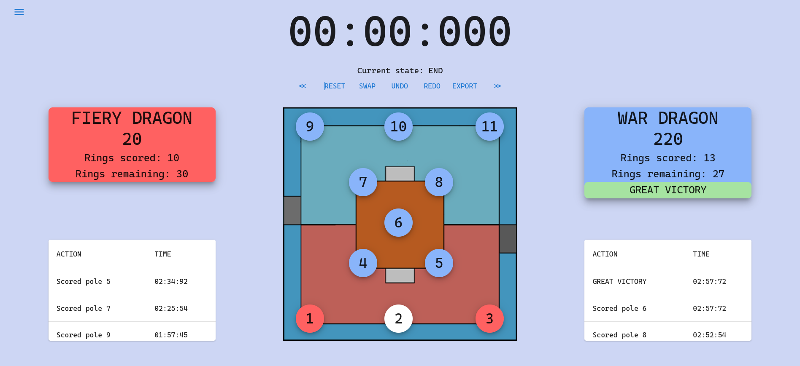
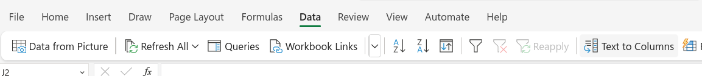
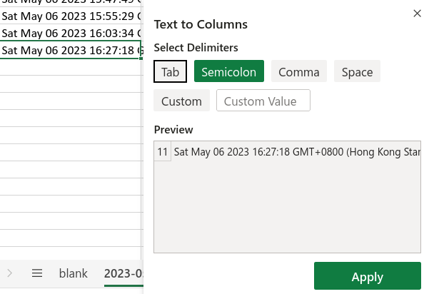

# 2023-scoreboard (WIP)

[Link](https://nc108x.github.io/2023-scoreboard/) \
Designed for the internal use of the HKUST Robotics Team.

First time using Javascript and ReactJS so code is very bad I am trying my best orz \
WIP so stuff may be broken use at your own risk.

### Usage

- Left click on a pole to add a red ring and right click to add a blue ring.
- **Exporting data**

  - After copying the generated string to the Excel spreadsheet, make use of the "Text to columns" feature to split the data into their corresponding cells. Make sure to use the "semicolon" delimiter option and NOT the "space" delimiter.   
    \
    _Data -> Text to Columns_

    \
    _Choose "semicolon" and only "semicolon" for the delimiter_
     

- Other controls are pretty self-explanatory.

### Known Issues

- Currently does not support both sides achieving endgame. I kind of want to support this (in case a team wants to continue on their own after the other side has already achieved endgame for training purposes), but also cannot be bothered to completely redo how score calculation/endgame detection is done. Might(?) try in the future but no promises.

- Resizing the browser window/scuffed aspect ratios will break the UI layout spectacularly because I haven't figured out how resizing works lmao. But you'll probably be using it in fullscreen... right? |･ω･) Current workaround is to simply zoom out on the browser side.

- When interacting with the UI while the timer is running, the timer may stutter. This is solely a visual glitch, and the time itself seems to be unaffected. Will leave this be until it is proven to severely affect usage.

- Timer does not display `01:00:00` or `03:00:00` for the 1/3 minute countdown, and takes away a few ms because reasons. No one cares about those extra ms so I'll pretend I don't know about this.
