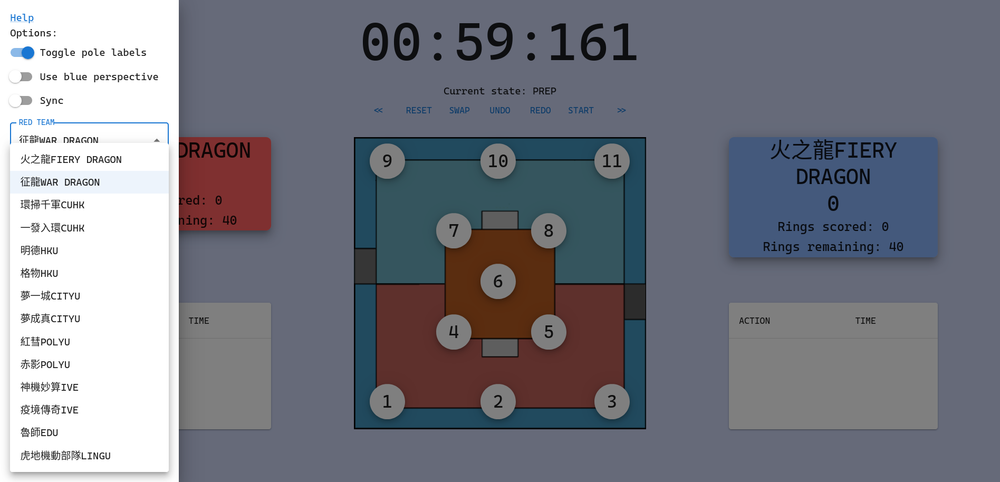

# 2023-scoreboard

[Link](https://nc108x.github.io/2023-scoreboard/) \
Designed for the internal use of the HKUST Robotics Team. \
Project is now archived because we got owned by CUHK and HKU feelsbadman

Thanks to [@LeoLYW12138](https://github.com/LeoLYW12138) for helping debug my dumb issues and setting up the backend, and [@kkdlau](https://www.github.com/kkdlau), [@TrebledJ](https://github.com/TrebledJ), and everyone else in the HKUST Robocon team for their suggestions and help.

First time using Javascript and ReactJS so code is very bad I am trying my best orz \
Stuff may be broken so use at your own risk. (go check out [Known Issues](https://github.com/nc108x/2023-scoreboard/tree/react#known-issues))

### Disclaimer

I am not responsible for frozen mainboards, dead batteries, thermonuclear war, or you getting owned because the scoreboard failed. Please
do some research if you have any concerns about features included in this scoreboard.

### Usage

- Left click on a pole to add a red ring and right click to add a blue ring.
- Ctrl+Z/Y (or Cmd+Z/Y) are valid shortcuts.
- Options sidebar is on the top left corner.
- **Exporting data**

  - After copying the generated string to the Excel spreadsheet, make use of the "Text to columns" feature to split the data into their corresponding cells. Make sure to use the "semicolon" delimiter option and NOT the "space" delimiter.   
    \
    _Data -> Text to Columns_

    \
    _Choose "semicolon" and only "semicolon" for the delimiter_
     

- **Syncing across multiple instances**

  - Requires access to a Firebase Realtime Database in order to sync.

  - Can be toggled from the sidebar.

  - **_PLEASE READ THE WARNINGS BEFORE TOGGLING SYNC_**

- Other controls are pretty self-explanatory.

### Known Issues

- When sync is toggled, the time displayed may not be 100% accurate due to the delay from syncing game states. Expect a +/-3s difference between different instances of the scoreboard. **UPDATE: This seems to have been improved but still don't expect it to be 100% perfect. Maybe +/-1s?**

- **If a user toggles sync while a game is already running, the latecomer may be able to overwrite the synced states with their unsynced data. To avoid this, please ensure all users have enabled sync BEFORE the timer is started, and that no one attempts to join late.**

- Resizing the browser window/scuffed aspect ratios will break the UI layout spectacularly because I haven't figured out how resizing works lmao. But you'll probably be using it in fullscreen... right? |･ω･) Current workaround is to simply zoom out on the browser side.

- When interacting with the UI while the timer is running, the timer may stutter. This is solely a visual glitch, and the time itself seems to be unaffected. Will leave this be until it is proven to severely affect usage.

- Timer does not display `01:00:00` or `03:00:00` for the 1/3 minute countdown, and takes away a few ms because reasons. No one cares about those extra ms so I'll pretend I don't know about this.
